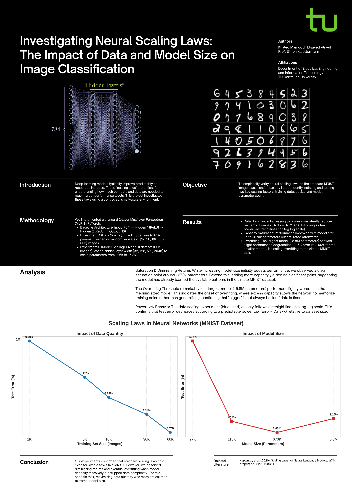

# Bigger is Better? Investigating Neural Scaling Laws



## 📌 Overview
This project empirically verifies **Neural Scaling Laws**—the observation that deep learning model performance improves predictably with increased resources. Using a controlled environment (MNIST dataset and MLP architectures), I independently isolated and tested two critical scaling factors:
1.  **Data Quantity:** varying training set size from 1k to 60k images.
2.  **Model Size:** varying parameter count from ~26k to ~5.8M.

The goal was to replicate standard scaling behaviors (power-law trends, saturation, and overfitting) on a small scale to understand the fundamental trade-offs in resource allocation for ML projects.

## 📊 Key Findings


* **Data is King (for this task):** Increasing data quantity consistently reduced error following a clear power law (linear on a log-log scale).
* **Diminishing Returns:** While larger models initially performed better, performance saturated around ~670k parameters.
* **The Overfitting Threshold:** The largest model (~5.8M params) performed slightly *worse* than medium models, demonstrating that without sufficient data, excess capacity leads to overfitting noise rather than learning generalizable features.

## 🛠️ Methodology
* **Framework:** PyTorch
* **Architecture:** 2-Layer Multilayer Perceptron (MLP) with ReLU activations.
* **Experiments:**
    * *Experiment A:* Fixed model (512 hidden units), trained on subsets of [1k, 5k, 10k, 30k, 60k] samples.
    * *Experiment B:* Fixed data (60k samples), trained models with hidden widths of [32, 128, 512, 2048] units.

## 💻 How to Run
1.  **Clone the repository:**
    ```bash
    git clone [https://github.com/YOUR-USERNAME/mnist-scaling-laws.git](https://github.com/YOUR-USERNAME/mnist-scaling-laws.git)
    cd mnist-scaling-laws
    ```
2.  **Install dependencies:**
    ```bash
    pip install -r requirements.txt
    ```
3.  **Run Experiments:**
    ```bash
    # Run Data Scaling Experiment
    python exp_a_data_scaling.py

    # Run Parameter Scaling Experiment
    python exp_b_param_scaling.py

    # Generate Plots
    python plot_results.py
    ```

## 👨‍🎓 Authors & Acknowledgments
* **Khaled Mamdouh Elsayed Ali Auf** - *TU Dortmund University*
* Special thanks to Prof. Simon Kluettermann for project supervision.
